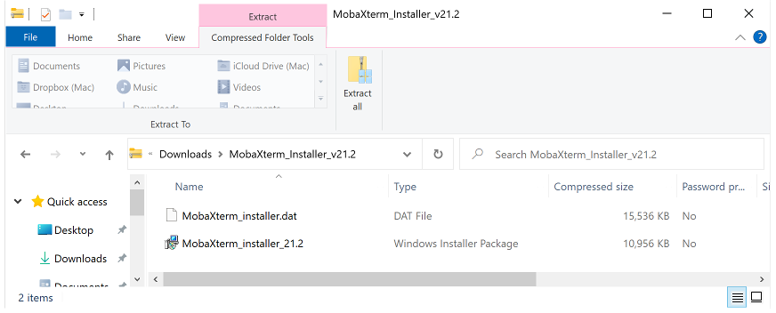

# Setup on Windows 10


The following instructions are designed to help get you up and running with Windows 10 PC for development
in CSCI 1302. The majority of the time, you will not be developing directly on your PC. Instead,
you will use your PC to connect to a remote server via a terminal emulator. Once connected, the
commands that you type and the programs that you run will be executed on the remote server instead
of on your local machine.

## Install MobaXterm

For Windows 10, we recommend the use of a [terminal emulator](https://en.wikipedia.org/wiki/Terminal_emulator)
called [MobaXterm](https://mobaxterm.mobatek.net).

1. Download and install the free Home version of MobaXterm (Installer edition) at the link presented below:

   **WARNING:** If you download a `.zip` file for one of the MobaXterm installers, then you need to fully
   extract the `.zip` file into a folder before attempting to install. Do not attempt to run the installer
   from within the `.zip` file. Instead, run the installer program from within the folder that you extract to.

   

   MobaXterm Website: https://mobaxterm.mobatek.net/download-home-edition.html

## Setup Backspace (Required)

MobaXterm often modifies the backspace key to send `C-h` instead of the backspace key.
This can obviously cause problems if you're used to using the backspace key.
To fix this issue, follow these steps:

1. Open MobaXterm and launch a local terminal.

1. **Do NOT connect to Odin yet!** Instead, type the commands below to download and
   rename a configuration file. You should only have to do this once.

   ```
   $ wget http://cobweb.cs.uga.edu/~mec/cs1302/mobaxterm.bashrc
   $ mv mobaxterm.bashrc .bashrc
   $ source .bashrc
   ```
1. Now, you should be able to `ssh` into Odin with MobaXterm and have your
   beautiful backspace work as intended!

## Setup `Ctrl-<SPACE>` and `Ctrl-X` (Required)

In newer versions of MobaXterm, `Ctrl-<SPACE>` (`Ctrl + SPACE`) and `Ctrl-X` (`Ctrl + Shift + X`) 
may be mapped to MobaXterm-specific shortcuts. This will cause problems when it comes time to
work in Emacs as those key combinations are used quite often. Please update
your MobaXterm settings by doing the following steps:

   1. Select "Settings" from the menu bar, then "Keyboard shortcuts".
   1. In the window that appears, find and select the shortcut for "Ctrl-SPACE" or "Ctrl + SPACE".
   1. Once selected, find the "Edit keyboard shortcut" dropdown list and
      change it to "" or `<none>` (which should be at the top of the list).
   1. Repeat the previous step on the shortcut for "Ctrl-X" or "Ctrl + Shift + X".
   1. Select "OK". The issue should now be resolved.

<hr/>

[](http://creativecommons.org/licenses/by-nc-nd/4.0/)

<small>
Copyright &copy; Michael E. Cotterell, Bradley J. Barnes, and the University of Georgia.
This work is licensed under a <a rel="license" href="http://creativecommons.org/licenses/by-nc-nd/4.0/">Creative Commons Attribution-NonCommercial-NoDerivatives 4.0 International License</a> to students and the public.
The content and opinions expressed on this Web page do not necessarily reflect the views of nor are they endorsed by the University of Georgia or the University System of Georgia.
</small>
